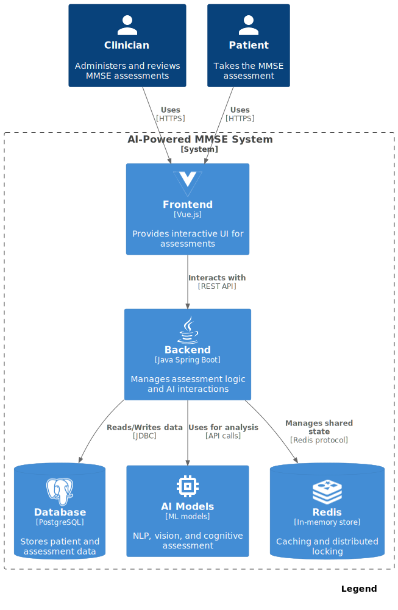

# AI-Powered MMSE Application

## Introduction

The AI-Powered MMSE Application is a cutting-edge web-based tool that leverages artificial intelligence to enhance the
traditional Mini-Mental State Examination (MMSE). It offers healthcare providers an efficient and accurate way to assess
cognitive health through real-time AI analysis.


## Key Features

- **AI-Enhanced Cognitive Assessment**: Conducts MMSE tests with integrated AI-driven analysis.
- **User Management**: Handles secure management of patient profiles, test results, and sessions.
- **Real-Time Data Processing**: Supports dynamic question rendering and real-time response evaluation.
- **Data Security**: Implements robust encryption and role-based access control (RBAC) to protect sensitive data.
- **Responsive User Interface**: Developed with Vue.js to provide a smooth experience across devices.

## Technical Stack

### Backend

- **Spring Boot v3.2**
- **Java v17**
- **PostgreSQL** for database management
- **Redis** for caching

### Frontend

- **Vue.js v3.4**
- **TypeScript**
- **Bootstrap v5.3**

### Storage & Caching

- **MinIO** for secure media file storage
- **Redis** for caching frequently accessed data

### AI Integration

- **Ollama**: Runs `ollama run llama3.1:70b` for AI-driven analysis
- **OpenAI API**: Integration with GPT-4 for enhanced cognitive assessment

### Testing

- **JUnit**, **Mockito**, and **Cypress** for comprehensive testing

### CI/CD & Containerization

- **GitHub Actions** for continuous integration and deployment
- **Docker** and **Docker Compose** for containerization

## Architecture 🏗️



The architecture includes:

- **Vue.js frontend**: Manages user interactions and UI components.
- **Spring Boot backend**: Handles business logic, data processing, and AI operations.
- **PostgreSQL database**: Manages patient data and MMSE results.
- **Redis cache**: Improves performance by storing frequently accessed data.
- **MinIO storage**: Manages media files securely.

### Prerequisites

- **Java v17**
- **Node.js v18.16.1**
- **npm v9.8.0**
- **Docker v25.0.2**
- **Docker Compose v2.24.3**
- **Ollama**: Required to run the AI model (`ollama run llama3.1:70b`)
- **OpenAI API Key**: Required for GPT-4 integration

### Local Development Setup

1. **Install Docker and Docker Compose**: Ensure Docker and Docker Compose are installed and configured.
2. **Start All Containers**: Use the provided script to start all required Docker containers:
   ```bash
   sh start-all-containers.sh
3. Install Frontend Dependencies:
    ```bash
    npm install
    ```

### Backend Setup

Compile and start the backend using Maven:

```maven
mvn clean install
mvn spring-boot:run
```

### Frontend Setup

Start the frontend server:

```
npm start
```

Access the application at http://localhost:8080.

### API Key Setup

Ensure that your environment includes the OpenAI API key:

```bash
export OPENAI_API_KEY="your_openai_api_key"
```

### Continuous Integration and Deployment

- CI Pipeline: Configured with GitHub Actions for automated testing and deployment.
- Dependabot: Manages dependency updates and applies security patches

---

Deployment
